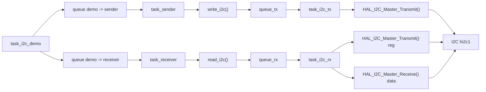
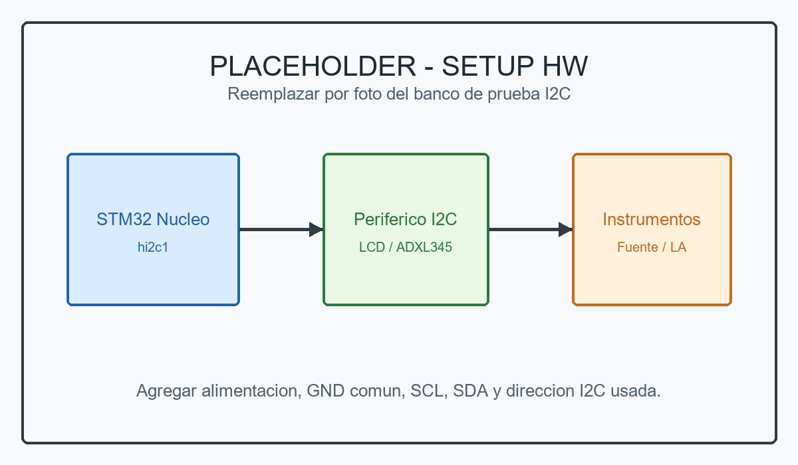
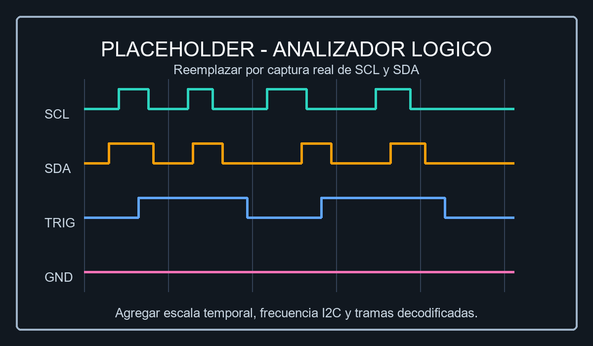
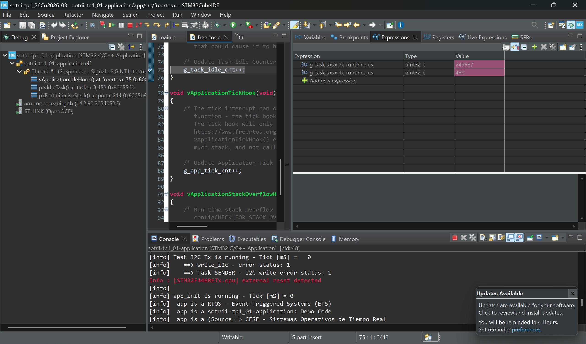

# TP1 - Punto 1 - Device Driver I2C de FreeRTOS

## Objetivo

El punto 1 implementa y usa un device driver I2C sobre FreeRTOS en `sotrii-tp1_01-application`. La aplicacion no accede directamente a la HAL desde sus tareas de demo, sino que se comunica con el driver mediante funciones de interfaz y colas de FreeRTOS.

El driver queda alineado con el enunciado:

| Requerimiento | Implementacion |
| --- | --- |
| Device Driver | I2C |
| Patron de diseno | Synchronous |
| Gestion del periferico | Polling |
| Acceso al periferico | API STM32-F4 HAL |
| Gatekeepers | Una tarea TX y una tarea RX |
| Canal MCU recibido por parametro | `open_i2c(&hi2c1)` guarda la referencia a `hi2c1` en `device_id` |
| Almacenamiento | Queue |

## Arquitectura de la Aplicacion

La aplicacion esta separada en tareas de demo, interfaz del driver y tareas gatekeeper:

`task_i2c_demo()` arbitra que caso de prueba ejecutar. Para no cargar logica de perifericos en el driver, la demo arma comandos de aplicacion y los envia a `task_sender()` o `task_receiver()` usando colas propias. Luego esas tareas llaman a `write_i2c()` o `read_i2c()`.

## Estructura del Dispositivo

La estructura principal del driver es `task_i2c_dta_t`. Representa el dispositivo I2C abierto e incluye:

- `device_id`: referencia al canal I2C del MCU (`I2C_HandleTypeDef *`).
- `mutex_bus`: proteccion del bus I2C compartido entre TX y RX.
- `task_tx` y `task_rx`: tareas gatekeeper del driver.
- `queue_tx` y `queue_rx`: colas de comandos hacia los gatekeepers.
- `sem_tx_done` y `sem_rx_done`: semaforos de finalizacion para el patron sincronico.
- `mutex_tx` y `mutex_rx`: evitan que dos tareas llamen simultaneamente a la misma operacion sincronica.
- `tx_status` y `rx_status`: estados portables del driver.

Las solicitudes que viajan por cola no son bytes sueltos del bus, sino comandos del driver:

- `task_i2c_tx_dta_t`: direccion I2C, puntero a datos y cantidad de bytes.
- `task_i2c_rx_dta_t`: direccion I2C, registro inicial, puntero a buffer destino y cantidad de bytes.

## Funciones de Interfaz

El driver expone la interfaz pedida por el TP:

| Funcion | Uso actual |
| --- | --- |
| `open_i2c(I2C_HandleTypeDef *h_i2c_device)` | Inicializa la estructura del driver, crea colas, semaforos, mutex y tareas gatekeeper. |
| `release_i2c(I2C_HandleTypeDef *h_i2c_device)` | Punto de cierre/liberacion del driver. |
| `write_i2c(I2C_HandleTypeDef *h_i2c_device, uint16_t address, uint8_t *data, uint16_t size)` | Encola una transferencia TX y espera su finalizacion. |
| `read_i2c(I2C_HandleTypeDef *h_i2c_device, uint16_t address, uint8_t reg, uint8_t *data, uint16_t size)` | Encola una lectura RX y espera su finalizacion. |
| `ioctl_i2c(I2C_HandleTypeDef *h_i2c_device)` | Punto de extension para configuracion futura. |

Las funciones `write_i2c()` y `read_i2c()` devuelven un estado propio del driver:

- `TASK_I2C_STATUS_OK`
- `TASK_I2C_STATUS_ERROR`
- `TASK_I2C_STATUS_BUSY`
- `TASK_I2C_STATUS_TIMEOUT`

Esto mantiene la interfaz portable y evita exponer directamente `HAL_StatusTypeDef` a la aplicacion.

## Patron Sincronico

El patron sincronico se implementa bloqueando intencionalmente a la tarea llamadora hasta que la tarea gatekeeper termina la operacion sobre el bus.

### Escritura

1. La tarea de aplicacion llama a `write_i2c()`.
2. `write_i2c()` toma `mutex_tx`, limpia un posible token viejo de `sem_tx_done`, encola la solicitud en `queue_tx` y espera el semaforo.
3. `task_i2c_tx()` recibe el comando desde `queue_tx`.
4. `task_i2c_tx()` toma `mutex_bus`, llama a `HAL_I2C_Master_Transmit()` con timeout y libera el bus.
5. El gatekeeper guarda el resultado convertido a `task_i2c_status_t` y libera `sem_tx_done`.
6. `write_i2c()` retorna el estado a la tarea que hizo la peticion.

### Lectura

1. La tarea de aplicacion llama a `read_i2c()`.
2. `read_i2c()` toma `mutex_rx`, encola la solicitud en `queue_rx` y espera `sem_rx_done`.
3. `task_i2c_rx()` recibe la solicitud.
4. El gatekeeper toma `mutex_bus` y ejecuta internamente la secuencia I2C:
   - escritura del registro con `HAL_I2C_Master_Transmit()`;
   - lectura de datos con `HAL_I2C_Master_Receive()`.
5. El resultado se convierte a `task_i2c_status_t`, se guarda en `rx_status` y se libera `sem_rx_done`.
6. `read_i2c()` retorna el estado a la tarea llamadora.

De esta forma, la aplicacion no necesita hacer manualmente una secuencia `write_i2c()` + `read_i2c()` para leer un registro. La secuencia queda encapsulada dentro del driver.

## Uso de la HAL STM32-F4

El acceso al periferico se concentra en las tareas gatekeeper:

- `task_i2c_tx()` usa `HAL_I2C_Master_Transmit()`.
- `task_i2c_rx()` usa `HAL_I2C_Master_Transmit()` para seleccionar registro y `HAL_I2C_Master_Receive()` para leer datos.

Ambas operaciones usan timeout HAL (`TASK_I2C_HAL_TIMEOUT_MS`) para evitar quedar bloqueadas indefinidamente ante un bus colgado o un periferico sin respuesta.

## Demos de Prueba

La tarea `task_i2c_demo()` permite probar el driver con perifericos reales conectados al bus:

- Display LCD con expansor PCF8574T: prueba de escritura I2C.
- ADXL345: prueba de lectura I2C.
- Modo combinado: lectura de inclinacion desde ADXL345 e impresion del resultado en el LCD.

La seleccion de la demo queda configurable desde el `.h` de la tarea de demo, para poder elegir el periferico conectado sin modificar el driver.

## Evidencia de Prueba

### Setup de Prueba HW

Reemplazar la siguiente imagen por una foto del banco real con la placa STM32 Nucleo, el periferico I2C conectado, alimentacion, GND comun, `SCL` y `SDA`.

### Analizador Logico

Reemplazar la siguiente imagen por una captura del analizador logico mostrando `SCL` y `SDA`. Para este punto conviene incluir una transaccion de escritura al LCD y una lectura de registro del ADXL345.

## Medicion de WCET

### Medicion observada con demo 2

Durante la ejecucion de la demo 2 se observaron las siguientes expresiones desde STM32CubeIDE:

| Variable observada | Valor | Interpretacion |
| --- | ---: | --- |
| `g_task_xxxx_tx_runtime_us` | `480 us` | Tiempo observado para el ciclo TX del gatekeeper I2C. |
| `g_task_xxxx_rx_runtime_us` | `249587 us` | Tiempo observado para el ciclo RX del gatekeeper I2C. |

Al inspeccionar `task_i2c.c`, la medicion se reinicia antes de `xQueueReceive()` y se toma despues de completar la operacion HAL. Por lo tanto, estos valores representan el tiempo de ciclo observado de la tarea gatekeeper, no estrictamente el WCET puro de `write_i2c()` o `read_i2c()`.

En particular, el valor de RX queda cercano a `250 ms` porque incluye el tiempo que `task_i2c_rx()` permanece bloqueada esperando un nuevo comando en `queue_rx`. Para medir exclusivamente el acceso al periferico, la ventana de medicion deberia comenzar despues de `xQueueReceive()` y terminar luego de `HAL_I2C_Master_Transmit()` / `HAL_I2C_Master_Receive()`.

## Estado Frente al Enunciado

| Requerimiento del punto 1 | Estado |
| --- | --- |
| Estructura de datos con `device_id`, `device_queue`, etc. | Cumple mediante `task_i2c_dta_t`, `queue_tx` y `queue_rx`. |
| Funciones `open()`, `release()`, `write()`, `read()`, `ioctl()` | Cumple con prefijo `i2c`. |
| Patron `Synchronous` | Cumple mediante colas + semaforos de finalizacion. |
| Gestion `Polling` | Cumple usando HAL bloqueante con timeout. |
| API STM32-F4 HAL | Cumple. |
| Dos funciones gatekeeper TX/RX | Cumple con `task_i2c_tx()` y `task_i2c_rx()`. |
| Gatekeepers reciben referencia al canal I2C | Cumple: `open_i2c(&hi2c1)` guarda el canal en `device_id` y lo pasa a las tareas. |
| Almacenamiento `Queue` | Cumple con `queue_tx` y `queue_rx`. |

## Conclusiones

El punto 1 queda cubierto con un driver I2C sincrónico, portable a nivel de interfaz y aislado de la logica de aplicacion. Las tareas de aplicacion no llaman directamente a la HAL: generan comandos, los envian por colas y reciben el resultado por las funciones `write_i2c()` y `read_i2c()`.
