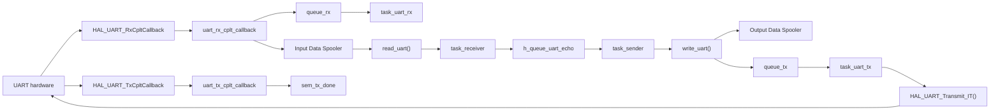
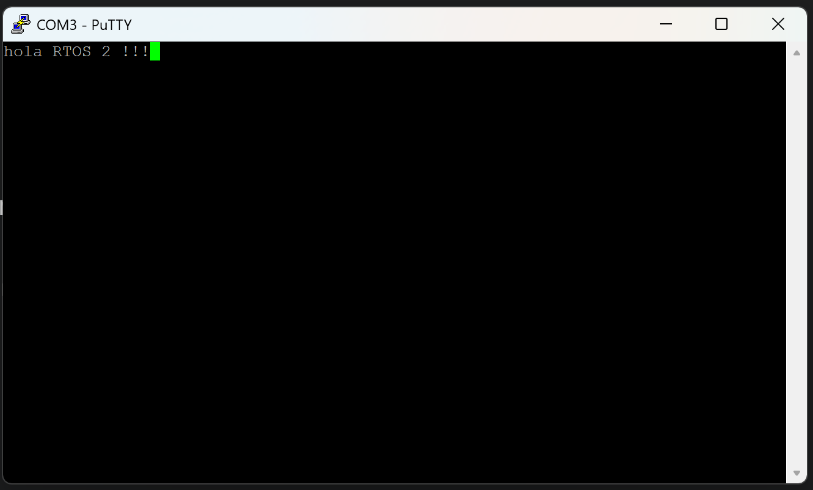
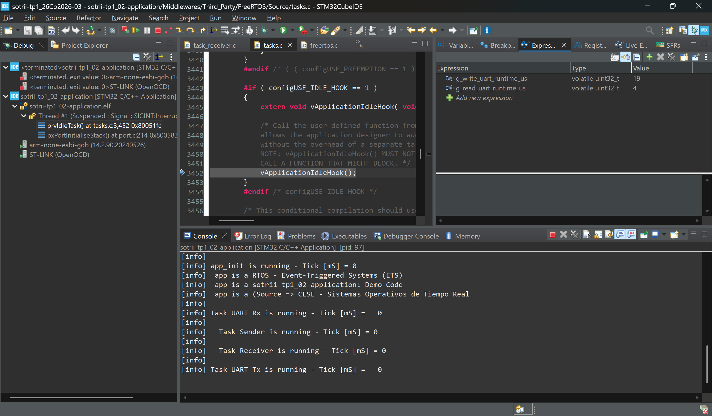

# TP1 - Punto 2 - Device Driver UART de FreeRTOS

## Objetivo

El punto 2 implementa y usa un device driver UART sobre FreeRTOS en `sotrii-tp1_02-application`. La aplicacion no accede directamente a la HAL para enviar o recibir bytes: usa las funciones de interfaz del driver y este encapsula la comunicacion con el periferico mediante tareas gatekeeper, colas, interrupciones y spoolers.

El driver queda alineado con el enunciado del TP:

| Requerimiento | Implementacion |
| --- | --- |
| Device Driver | UART |
| Patron de diseno | Asynchronous |
| Gestion del periferico | Interrupt |
| Acceso al periferico | API STM32-F4 HAL |
| Gatekeepers | Una tarea TX y una tarea RX |
| Canal MCU recibido por parametro | `open_uart(&huart2)` guarda la referencia en una tabla de drivers activos |
| Almacenamiento | Queue with Input and Output Data Spooler |
| Allocation | Dynamic |

## Arquitectura de la Aplicacion

La aplicacion implementa una demo de eco UART. `task_receiver()` consume los bytes recibidos desde el driver y los envia por una cola de aplicacion a `task_sender()`. Luego `task_sender()` vuelve a transmitirlos usando `write_uart()`.



En `app.c` se crean:

- `h_queue_uart_echo`: cola de aplicacion entre `task_receiver()` y `task_sender()`.
- `task_sender`: tarea que transmite por UART lo recibido desde la cola de eco.
- `task_receiver`: tarea que drena el driver UART y publica bloques recibidos en la cola de eco.
- El driver UART mediante `open_uart(&huart2)`.

## Estructura del Dispositivo

La estructura principal del driver es `task_uart_dta_t`. Cada instancia representa una UART abierta y contiene:

- `device_id`: referencia al canal UART del MCU (`UART_HandleTypeDef *`).
- `is_active`: indica si el slot de la tabla esta en uso.
- `task_tx` y `task_rx`: tareas gatekeeper del driver.
- `queue_tx` y `queue_rx`: colas de eventos para despertar gatekeepers.
- `tx_spooler`: output data spooler circular.
- `rx_spooler`: input data spooler circular.
- `mutex_tx_spooler`: proteccion del spooler TX.
- `sem_tx_done`: sincronizacion entre el gatekeeper TX y la ISR de fin de transmision.
- `rx_byte`: byte armado por `HAL_UART_Receive_IT()`.
- `tx_status` y `rx_status`: estados portables del driver.

La implementacion actual usa una tabla:

```c
static task_uart_dta_t g_drivers[TASK_UART_MAX_DEVICES];
```

con:

```c
#define TASK_UART_MAX_DEVICES 2
```

Esto permite abrir mas de una instancia UART, por ejemplo:

```c
open_uart(&huart1);
open_uart(&huart2);
```

El driver identifica cada slot por instancia fisica de periferico:

```c
device_id->Instance == h_uart_device->Instance
```

De esta forma `app_it.c` no queda atado a `USART2`; pregunta si existe un driver activo para la instancia que disparo la interrupcion.

## Funciones de Interfaz

El driver expone la interfaz pedida por el TP:

| Funcion | Uso actual |
| --- | --- |
| `open_uart(UART_HandleTypeDef *h_uart_device)` | Busca un slot libre en `g_drivers`, inicializa spoolers, colas, semaforos, tareas gatekeeper y arranca la recepcion por interrupcion. |
| `release_uart(UART_HandleTypeDef *h_uart_device)` | Libera recursos dinamicos, aborta interrupciones UART y desactiva el slot correspondiente. |
| `write_uart(UART_HandleTypeDef *h_uart_device, uint8_t *data, uint16_t size)` | Copia datos al output spooler y despierta al gatekeeper TX. No espera a que el hardware transmita todos los bits. |
| `read_uart(UART_HandleTypeDef *h_uart_device, uint8_t *data, uint16_t size, uint16_t *read_size)` | Drena el input spooler y retorna inmediatamente con los bytes disponibles. |
| `ioctl_uart(UART_HandleTypeDef *h_uart_device)` | Punto de extension para configuracion futura. |
| `uart_is_active_instance(UART_HandleTypeDef *h_uart_device)` | Helper usado por `app_it.c` para saber si una interrupcion UART corresponde a un driver activo. |

Las funciones devuelven estados propios del driver:

- `TASK_UART_STATUS_OK`
- `TASK_UART_STATUS_ERROR`
- `TASK_UART_STATUS_BUSY`
- `TASK_UART_STATUS_TIMEOUT`
- `TASK_UART_STATUS_EMPTY`
- `TASK_UART_STATUS_FULL`

Esto mantiene la interfaz portable y evita exponer directamente `HAL_StatusTypeDef` a las tareas de aplicacion.

## Patron Asincronico

El patron asincronico se observa en que `write_uart()` y `read_uart()` no bloquean esperando al hardware fisico.

### Transmision

1. `task_sender()` recibe un bloque desde `h_queue_uart_echo`.
2. Llama a `write_uart(&huart2, data, size)`.
3. `write_uart()` copia el payload al `tx_spooler`.
4. `write_uart()` encola un evento en `queue_tx` para despertar `task_uart_tx()`.
5. `task_uart_tx()` extrae bloques del output spooler y llama a `HAL_UART_Transmit_IT()`.
6. Cuando el hardware termina, `HAL_UART_TxCpltCallback()` llama a `uart_tx_cplt_callback()`.
7. La callback libera `sem_tx_done` para que el gatekeeper continue con el siguiente bloque si queda informacion pendiente.

La cola no transporta todo el payload. Transporta eventos. El payload queda en el spooler del driver.

### Recepcion

1. `open_uart()` arma la primera recepcion con `HAL_UART_Receive_IT()`.
2. Cuando llega un byte, `HAL_UART_RxCpltCallback()` llama a `uart_rx_cplt_callback()`.
3. `uart_rx_cplt_callback()` copia el byte recibido al `rx_spooler`.
4. La callback encola un evento en `queue_rx` y rearma `HAL_UART_Receive_IT()`.
5. `task_uart_rx()` despierta y mantiene explicito el gatekeeper RX del driver.
6. `task_receiver()` llama periodicamente a `read_uart()` para drenar el input spooler.

Este flujo es no bloqueante para la tarea de aplicacion: si no hay bytes, `read_uart()` retorna `TASK_UART_STATUS_EMPTY`.

## Manejo Generico de Instancias UART

Tomando como referencia el enfoque del branch `MEVS_TP1`, el callback HAL no pregunta por una UART fija como `USART2`. En cambio, `app_it.c` usa:

```c
if (uart_is_active_instance(huart))
{
    uart_rx_cplt_callback(huart);
}
```

Internamente el driver recorre la tabla `g_drivers[]` y busca un slot activo cuya instancia coincida con la del handle recibido por HAL:

```c
g_drivers[i].is_active &&
g_drivers[i].device_id->Instance == h_uart_device->Instance
```

Esto permite que la misma interfaz soporte mas de una UART abierta, por ejemplo `huart1` y `huart2`, sin duplicar callbacks ni hardcodear perifericos en `app_it.c`.

## Uso de la HAL STM32-F4

El acceso al periferico se concentra en el driver:

- `open_uart()` arranca la recepcion con `HAL_UART_Receive_IT()`.
- `task_uart_tx()` transmite con `HAL_UART_Transmit_IT()`.
- `uart_rx_cplt_callback()` rearma la recepcion con `HAL_UART_Receive_IT()`.
- `release_uart()` detiene la actividad con `HAL_UART_Abort_IT()`.

Las tareas de aplicacion no llaman directamente a funciones HAL UART.

## Queue with Input and Output Data Spooler

El almacenamiento cumple el patron pedido por el TP:

- **Output Data Spooler**: `write_uart()` escribe el payload en `tx_spooler`, un buffer circular dinamico. La cola TX solo despierta al gatekeeper.
- **Input Data Spooler**: la ISR guarda cada byte recibido en `rx_spooler`, otro buffer circular dinamico. `read_uart()` drena ese buffer hacia la aplicacion.

La asignacion es dinamica porque `open_uart()` reserva memoria con:

```c
pvPortMalloc(TASK_UART_TX_SPOOLER_LENGTH);
pvPortMalloc(TASK_UART_RX_SPOOLER_LENGTH);
```

Los tamanos configurados son:

| Recurso | Valor |
| --- | ---: |
| `TASK_UART_TX_QUEUE_LENGTH` | `5` |
| `TASK_UART_RX_QUEUE_LENGTH` | `32` |
| `TASK_UART_TX_SPOOLER_LENGTH` | `256` bytes |
| `TASK_UART_RX_SPOOLER_LENGTH` | `256` bytes |
| `TASK_UART_TX_CHUNK_LENGTH` | `32` bytes |
| `TASK_UART_MAX_DEVICES` | `2` |

## Archivos Relevantes

| Archivo | Responsabilidad |
| --- | --- |
| `app/src/app.c` | Crea la cola de eco, tareas de aplicacion y abre el driver con `open_uart(&huart2)`. |
| `app/src/app_it.c` | Recibe callbacks HAL y los despacha al driver si la instancia UART esta activa. |
| `app/src/task_sender.c` | Recibe bloques desde la cola de eco y llama a `write_uart()`. |
| `app/src/task_receiver.c` | Llama a `read_uart()` y envia lo recibido a la cola de eco. |
| `app/src/task_uart.c` | Implementa los gatekeepers `task_uart_tx()` y `task_uart_rx()`. |
| `app/src/task_uart_interface.c` | Implementa la interfaz publica, tabla de drivers, spoolers y callbacks del driver. |
| `app/inc/task_uart_attribute.h` | Define estructuras, estados y tamanos del driver. |
| `app/inc/task_uart_interface.h` | Declara la API publica del driver. |
| `app/src/freertos.c` | Hooks de FreeRTOS para idle, tick y stack overflow. |

## Evidencia de Funcionamiento

La siguiente captura muestra la demo de eco UART funcionando desde una consola PuTTY conectada al puerto serie `COM3`. El texto ingresado por consola es recibido por el driver UART, consumido por `task_receiver()`, reenviado por la cola `h_queue_uart_echo` hacia `task_sender()` y transmitido nuevamente mediante `write_uart()`.



## Medicion de WCET

El TP pide medir el WCET de las funciones de interfaz del driver. Para esta implementacion conviene medir las llamadas desde las tareas de aplicacion:

| Funcion | Que mide | WCET medido |
| --- | --- | --- |
| `write_uart()` | Copia al output spooler y envio del evento a `queue_tx`. | `19 us` |
| `read_uart()` | Drenaje del input spooler hacia el buffer de aplicacion. | `4 us` |

Como el driver es asincronico, el WCET de `write_uart()` no incluye el tiempo fisico de transmision por baud rate. La transmision real ocurre despues en `task_uart_tx()` y finaliza por interrupcion.

Para no distorsionar la medicion, conviene deshabilitar logging semihosting dentro de la ventana medida.

En STM32CubeIDE se pueden agregar estas expresiones:

```c
g_write_uart_runtime_us
g_read_uart_runtime_us
```

Tambien existen variables internas del driver (`g_task_xxxx_tx_runtime_us`, `g_task_xxxx_rx_runtime_us` y `hal_xxxx_callback_runtime_us`), pero esas observan tareas/callbacks del driver y no son la medicion directa de la funcion de interfaz pedida por el TP.

### Medicion observada

Durante la prueba de eco UART se observaron las siguientes expresiones en STM32CubeIDE:



| Variable observada | Valor | Interpretacion |
| --- | ---: | --- |
| `g_write_uart_runtime_us` | `19 us` | Tiempo de ejecucion de `write_uart()`: copia al output spooler y notificacion por `queue_tx`. |
| `g_read_uart_runtime_us` | `4 us` | Tiempo de ejecucion de `read_uart()`: lectura del input spooler hacia el buffer de aplicacion. |

Estos valores son coherentes con el patron asincronico. La funcion `write_uart()` retorna rapido porque no espera a que se transmitan los bits por la UART; solo deja los datos preparados para el gatekeeper TX. La funcion `read_uart()` tambien retorna rapido porque copia los bytes disponibles en memoria y no espera nuevos datos del hardware.

## Estado Frente al Enunciado

| Requerimiento del punto 2 | Estado |
| --- | --- |
| Estructura de datos con `device_id`, `device_queue`, etc. | Cumple mediante `task_uart_dta_t`, `queue_tx`, `queue_rx`, spoolers y tabla `g_drivers[]`. |
| Funciones `open()`, `release()`, `write()`, `read()`, `ioctl()` | Cumple con prefijo `uart`. |
| Patron `Asynchronous` | Cumple: `write_uart()` y `read_uart()` retornan sin esperar el tiempo fisico del hardware. |
| Gestion `Interrupt` | Cumple mediante `HAL_UART_Transmit_IT()`, `HAL_UART_Receive_IT()` y callbacks HAL. |
| API STM32-F4 HAL | Cumple. |
| Dos funciones gatekeeper TX/RX | Cumple con `task_uart_tx()` y `task_uart_rx()`. |
| Gatekeepers reciben referencia al canal UART | Cumple: cada slot de `g_drivers[]` guarda `device_id` y las tareas reciben ese puntero como parametro. |
| Queue with Input and Output Data Spooler | Cumple con `rx_spooler` y `tx_spooler`; las colas transportan eventos. |
| Allocation `Dynamic` | Cumple con `pvPortMalloc()` para spoolers y creacion dinamica de colas, semaforos y tareas. |

## Conclusiones

El punto 2 queda cubierto con un driver UART asincronico, orientado a interrupciones y desacoplado de la aplicacion. La incorporacion de una tabla de drivers activos permite escalar el mismo codigo a mas de una instancia UART, manteniendo los callbacks genericos y evitando dependencias directas con `USART1`, `USART2` u otro periferico especifico dentro de `app_it.c`.
